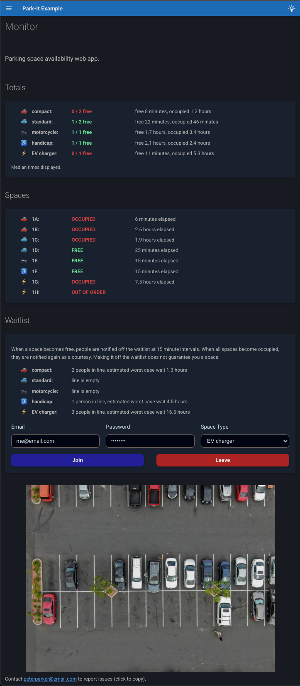

# park-it!

[](https://github.com/joshhubert-dsp/park-it/actions/workflows/test.yml) [](https://pypi.org/project/park-it/)  [](https://joshhubert-dsp.github.io/park-it/)

A framework for rapidly building parking space monitor web apps. Built on
Mkdocs-Material, implemented as a Mkdocs plugin. Designed for use with parked car
sensors, it will work with any web-connected sensor system that can fire a json payload at
your endpoint.


## Features

-   Provides an optional email waitlist for notifying users when spaces become free.
    Users don't need to make accounts, they join simply by inputting an email and shared
    password (which you must disseminate). Once a space opens up, every N (configurable)
    minutes the next person in line receives an email. Once the desired spaces are
    occupied again they receive another email as a courtsey notification. The email
    functionality works for free and relies on use of a dedicated Google account.
-   Allows for separately monitoring and waitlisting different types of parking spaces. Currently
    supports the following types: EV charger, handicap, compact, standard, motorcycle,
    and truck.
-   Provides the option to store space usage duration history (both occupied and free
    durations). When this is enabled, the UI shows median usage times for different
    space types, and estimates the worst case wait times for the waitlist.
    TODO compute other statistics.
-   Persistent state for the parking spaces, waitlist and usage duration history is
    accomplished using minimal sqlite databases.
-   App configuration is ergonomically defined in an `app-config.yaml` file.
-   As a Mkdocs plugin, it makes use of Mkdocs-Material for the frontend build, and so
    you can easily add static pages as markdown files and customize site aesthetics with
    tools from the Mkdocs ecosystem in `mkdocs.yml`. The default config includes a
    light/dark mode toggle that respects user system settings by default.




## Motivation / LoRa Digression

The motivating use case for this framework was monitoring EV charger availability in my apartment complex.
I was tired of having to drive all the way to the top of the parking structure to check if the vintage (non-app-enabled) EV
chargers there were available.

I ended up getting a little carried away and discovering the awesome LoRa transmission
technology: it is designed for IoT devices that don't need to transmit a lot of data,
works in the unlicencsed radio band around 900 MHz in the US, and sports extremely low power
consumption and a range of up to 3 miles in urban areas. Check it out, it's rad, and a
perfect fit for parked car sensors in a lot or garage. 

The organization [The Things Network](https://www.thethingsnetwork.org/) provides an
open source implementation of the internet connectivity portion for LoRa (the LoRaWAN
protocol), and have made their service free for hobbyist use, with a global network of
public LoRa gateways available. This makes it very straightforward to connect your
devices if a gateway is in range. The system I built this framework for uses this
[LoRa-based car
sensor](https://www.thethingsnetwork.org/device-repository/devices/nwave/nps405sm/) and
The Things Network LoRaWAN stack with integrated webhook functionality. The batteries in
those Nwave sensors are supposed to last 10 years!

Anyway, I am very excited about this technology, and I hope this project serves as an
inspiring, or at least titillating, example of a bootleg infrastructure solution it enables.


## Basic Setup

The steps to build a parking monitor system website for your organization/community:

0.  Determine a suitable parked car sensor and update delivery system for your needs. I heartily recommend the
    Nwave sensor linked above and The Things Network if LoRa connectivity is feasible for you.

1.  If you want to enable the email waitlist, make a dedicated Google account
    for your organization, and set up an installed app client secret for sending emails
    from that Gmail account. See
    [here](https://joshhubert-dsp.github.io/park-it/gmail-setup) for details.

2.  Install the park-it package in your python environment with `pip install park-it` or `uv add park-it`.

3.  To see a non-functional example of the site frontend build template on `localhost:8000`,
    run `park-it serve-example`.

4.  If you like what you see, run `park-it init` to copy the necessary structure
    directly from the package's `example` directory into your current working 
    directory. If you have a `.gitignore` file already in your directory, the
    recommended default ignores will be appended. Now you'll have the following
    structure:
    ```
    .
    ├── .gitignore
    ├── app-config.yaml
    ├── docs
    │ └── readme.md
    ├── mkdocs.yml
    └── server_example.py
    ```

5.  Modify the config file `app-config.yaml` to suit your needs. Example:
    <!-- MARKDOWN-AUTO-DOCS:START (CODE:src=src/park_it/example/app-config.yaml) -->
    <!-- The below code snippet is automatically added from src/park_it/example/app-config.yaml -->
    ```yaml
    # FastAPI app title, and displayed site title
    title: Park-It Example
    # FastAPI app description, and displayed site subtitle
    description: Parking space availability web app.
    # App version
    version: 0.1.0
    # App email address that users receive waitlist email notifications from
    app_email: app@email.com
    # Optional name attached to app_email for the email payload
    app_email_name: Peter Parker
    # Hosted URL, for adding a link in email notifications
    app_url: http://localhost:8000
    # Optionally, add a separate contact email address that users can badger about any issues with
    # the system. It will be listed at the bottom of the webpage and in email notifications.
    contact_email: peterparker@email.com
    
    # The id, user-friendly label and type for each individual parking space, with spaces
    # listed in desired display order.
    spaces:
      - sensor_id: dev1
        label: "1A"
        type: compact
      - sensor_id: dev2
        label: "1B"
        type: compact
      - sensor_id: dev3
        label: "1C"
        type: standard
      - sensor_id: dev4
        label: "1D"
        type: standard
      - sensor_id: dev5
        label: "1E"
        type: motorcycle
      - sensor_id: dev6
        label: "1F"
        type: handicap
      - sensor_id: dev7
        label: "1G"
        type: EV charger
      - sensor_id: dev8
        label: "1H"
        type: EV charger
        out_of_order: true # an out-of-order space will ignore update messages
    
    # Whether to show the "Spaces" section of the page with individual space occupancy and durations.
    show_individual_spaces: True
    # Whether to store occupied and free durations for computing median duration and wait-time estimates.
    store_usage_durations: True
    # The number of most recent duration values to compute medians over.
    usage_median_num: 100
    # Whether to activate the email waitlist functionality, and show the waitlist form on
    # the page.
    waitlist: True
    # Number of minutes to wait after a space becomes free before sending the first waitlist email
    # notification, to guard against noise from someone just adjusting their position.
    waitlist_free_debounce_minutes: 1
    # Number of minutes between sending each next waitlist notification while spaces are free.
    waitlist_interval_minutes: 15
    
    # Optionally, specify a descriptive image of the parking lot to display on the
    # webpage. Must be a path relative to project root.
    image:
      path: aerial-view-of-a-parking-lot-in-austin-in-need-of-repair.jpg
      caption: from https://lonestarpavingtx.com/common-reasons-to-consider-parking-lot-repair-in-austin/
      pixel_width: 800
    ```
    <!-- MARKDOWN-AUTO-DOCS:END -->

6.  Create a subclass of
    (`SpaceUpdateBaseModel`)[https://joshhubert-dsp.github.io/park-it/reference/space_update]
    for the specific shape of your car sensor update payload. See [here](https://joshhubert-dsp.github.io/park-it/model-gen) for
    instructions on how to autogenerate this.

7.  If you want to enable the email waitlist, assign a shared password that your users must
    enter using the environment variable `PARK_IT_WAITLIST_PASSWORD`. 

8.  Modify the default Mkdocs config file `mkdocs.yml` to suit your aesthetic needs.
    Also if you want additional static pages added to your site, you can add them as
    markdown files under `docs` in standard Mkdocs fashion. `mkdocs.yml` must include
    the following fields:
    ```yaml
    theme:
      name: material

    plugins:
      - park-it
    ```

9.  Build the static portion of the site with `mkdocs build`. It will build to the
    directory `site` by (Mkdocs) default.

10. Write a simple python script to define custom form input validation, and then build
    the dynamic web app from the Mkdocs build:
    <!-- MARKDOWN-AUTO-DOCS:START (CODE:src=src/park_it/example/server_example.py) -->
    <!-- The below code snippet is automatically added from src/park_it/example/server_example.py -->
    ```py
    """
    Example Park-It server program.
    
    - `DummySpaceUpdate` is a placeholder space update model class that will work with
    `tests/mock_updater_client.py` for testing purposes. You must create a model for
    your sensor's update payload.
    - if PROJECT ROOT is your current working dir, the commented out Path args
    are the defaults.
    """
    
    from pathlib import Path
    
    import uvicorn
    
    from park_it.app.build_app import build_app
    from park_it.models.space_update import DummySpaceUpdate
    
    # python-dotenv package recommended for setting env var `PARK_IT_WAITLIST_PASSWORD` in dev mode
    # from dotenv import load_dotenv
    # load_dotenv()
    
    PROJECT_ROOT = Path(__file__).parent
    
    if __name__ == "__main__":
        app = build_app(
            space_update_model=DummySpaceUpdate,
            # app_config=PROJECT_ROOT / "app-config.yaml",
            # sqlite_dir=PROJECT_ROOT / "sqlite-dbs",
            # google_token_path=PROJECT_ROOT / "auth-token.json",
            # site_dir=PROJECT_ROOT / "site",
        )
        uvicorn.run(app, host="127.0.0.1", port=8000)
    ```
    <!-- MARKDOWN-AUTO-DOCS:END -->

11. Host the app somewhere accessible to your community, and disseminate the shared
    waitlist password through communication channels.
